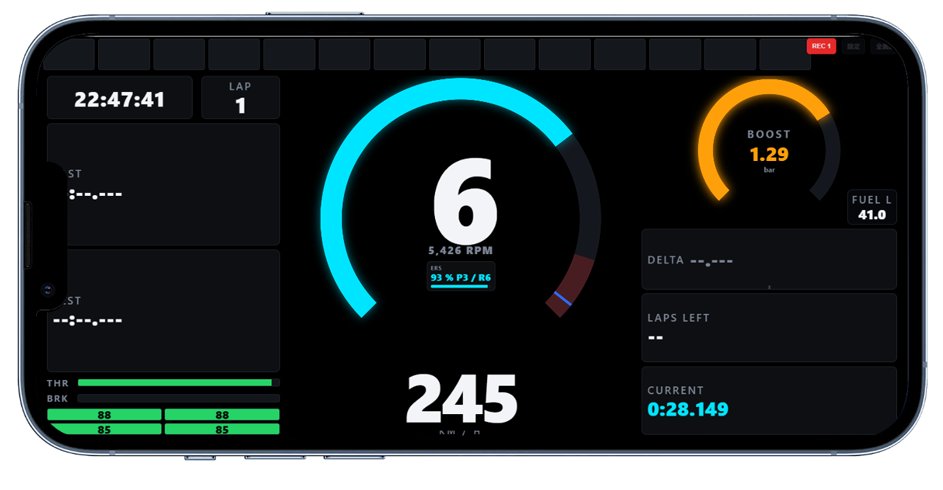
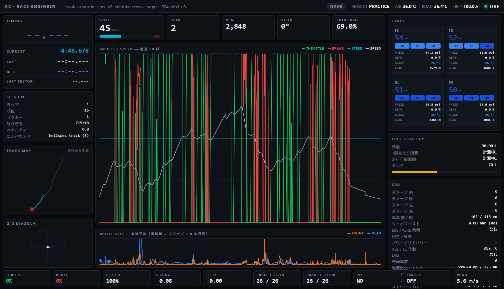

# Assetto Corsa テレメトリー LAN ブリッジ (claude)

Assetto Corsa（無印）のテレメトリーをゲームPCから読み取り、同じLAN上の
スマホ・タブレット・別PCのブラウザにリアルタイム表示します。
**インターネット接続は一切使いません。外部ライブラリも不要です（Python 3.8+ の標準ライブラリのみ）。**

できること

- **ドライバー用ダッシュボード**（スマホ・タブレット）… タコメーター、タイミングランプ、
  レッドゾーンで画面全体が赤く発光、シフト音、ブースト・燃料・ERS
- **レースエンジニア画面**（PC）… タイヤ・ブレーキ、入力トレース、G-G、燃料戦略、
  ACから読み出した実物のコースマップ、OBS経由のゲーム映像
- **走行ログ**… 60Hz・全チャンネルを自動記録し、そのままエンジニア画面で再生・ラップ比較

```
┌──────────────────────────┐                            ┌──────────────────┐
│ ゲームPC (Windows)       │  有線LAN / Wi-Fi           │ スマホ/タブレット│
│   Assetto Corsa          │ ---- WebSocket 60Hz ---->  │   /mobile        │
│   | 共有メモリ           │                            └──────────────────┘
│   bridge_claude.py       │                            ┌──────────────────┐
│   | 60Hz 記録            │ ---- WebSocket 60Hz ---->  │ 別PC             │
│   logs-claude\           │ <--- 過去ラップの再生 ---  │   /engineer      │
└──────────────────────────┘                            └──────────────────┘
```

---

## 目次

- [ファイル構成](#ファイル構成)
- [セットアップ（ゲームPC側）](#セットアップゲームpc側)
- [インターネットの無いPCへの導入](#インターネットの無いpcへの導入)
- [起動オプション](#起動オプション)
- [画面](#画面) — [ダッシュボード](#-mobile--ドライバー用ダッシュボード) / [エンジニア画面](#-engineer--レースエンジニア画面)
- [ゲーム映像の表示](#ゲーム映像の表示)
- [コースマップ](#コースマップ)
- [走行ログと再生（ロガー）](#走行ログと再生ロガー)
- [URL 一覧](#url-一覧)
- [共有メモリの扱い](#共有メモリの扱い)
- [仕組み](#仕組み)
- [トラブルシューティング](#トラブルシューティング)
- [拡張のヒント](#拡張のヒント)
- [更新履歴](#更新履歴)

---

## ファイル構成

```
ac-telemetry-claude/
├── start-claude.bat                  ★通常起動（ダブルクリック）
├── start-demo-claude.bat             ★デモ起動（ACを起動していなくても動く）
├── selftest-claude.bat               動作環境の自己診断
├── selftest_claude.py                同上（中身）
├── bridge_claude.py                  ゲームPCで動かす本体（HTTP + WebSocket サーバー）
├── ac_sharedmem_claude.py            AC 共有メモリのアクセス（ACSharedMemory）と構造体定義
├── trackmap_claude.py                コース形状をACから書き出すツール（後述）
├── logger_claude.py                  走行ログの記録・読み出し・CSV変換（後述）
├── mediamtx-claude.yml               映像配信（MediaMTX）用の設定ファイル（後述）
├── README-claude.md                  このファイル
├── logs-claude/                      走行ログの保存先（自動で作られる）
│   └── 20260908-143012_ks_.../         セッションごとのフォルダ
│       ├── session-claude.json         ラップの一覧（タイム・有効/無効）
│       ├── lap001.jsonl.gz             1ラップぶんの全チャンネル記録
│       └── lap002.jsonl.gz
└── web-claude/
    ├── index-claude.html             ポータル（各画面へのリンクと接続状態）
    ├── mobile-claude.html            スマホ・タブレット用ダッシュボード
    ├── engineer-claude.html          PC用レースエンジニア画面
    └── tracks-claude/                書き出したコース形状の置き場
        └── demo_circuit.json         デモ用のサンプル
```

---

## セットアップ（ゲームPC側）

1. **Python をインストール**（3.8 以上。3.11 以降推奨）
   [https://www.python.org/downloads/windows/](https://www.python.org/downloads/windows/) から入れる際は
   「Add python.exe to PATH」にチェックを入れてください。
   追加のパッケージインストールは不要です。
   **インターネットに繋がっていないPCの場合は、後述の
   「インターネットの無いPCへの導入」を参照してください。**
2. **フォルダを丸ごとゲームPCの好きな場所に置く**（例: `C:\ac-telemetry-claude`）
3. **Assetto Corsa の共有メモリを有効にする**
   AC は標準で共有メモリを出力しますが、Content Manager を使っている場合は
   `Settings → Custom Shaders Patch / Assetto Corsa → 共有メモリ (Shared memory)` が
   無効になっていないか確認してください。
4. **起動** — フォルダ内の **`start-claude.bat` をダブルクリック**するだけです。

   | ファイル                  | 用途                                                           |
   | ------------------------- | -------------------------------------------------------------- |
   | `start-claude.bat`      | 通常起動。ACのテレメトリーを配信します                         |
   | `start-demo-claude.bat` | **デモ起動**。ACを起動していなくても疑似データが流れます |

   どちらも Python を自動で探し、起動後にこのPCの既定ブラウザでポータルページを開きます。
   Python が見つからない場合はその旨を表示して止まるので、画面の指示に従ってください。

   コマンドから直接動かす場合は次の通りです。


   ```bat
   cd C:\ac-telemetry-claude
   python bridge_claude.py
   ```

   起動すると、接続用のURLが表示されます。

   ```
   ブラウザで開く URL:
     スマホ/タブレット  http://192.168.1.23:8720/mobile
     PC(エンジニア)     http://192.168.1.23:8720/engineer
   ```
5. **Windows ファイアウォールの許可**
   初回起動時にダイアログが出たら「**プライベート ネットワーク**」を許可してください。
   出なかった／誤って拒否した場合は、管理者権限の PowerShell で:

   ```powershell
   New-NetFirewallRule -DisplayName "AC Telemetry Bridge" -Direction Inbound `
     -Protocol TCP -LocalPort 8720 -Action Allow -Profile Private
   ```
6. **端末側でURLを開く**
   スマホ・タブレット・別PCのブラウザに、上に表示されたURLを入力します。
   `http://192.168.1.23:8720/` を開くと、各画面へのリンクページになります。

---

## インターネットの無いPCへの導入

ゲームPCがインターネットに繋がっていない場合の手順です。
**このソフト自体は外部ライブラリを一切使わないので、必要なのは Python 本体だけです。**
方法は2つあり、**B のほうが手軽**です。

### 方法A: インストーラを持ち込む（PCに Python を入れる）

1. インターネットに繋がっている別のPCで
   [https://www.python.org/downloads/windows/](https://www.python.org/downloads/windows/) を開く
2. **「Windows installer (64-bit)」**（`python-3.14.7-amd64.exe` のような名前、約 30 MB）
   をダウンロード。
   ※**「Windows installer」は単体で完結するオフラインインストーラ**です。
   名前が似ている「Windows **web-based** installer」は実行時にダウンロードが必要なので、
   こちらは選ばないでください。
3. USBメモリなどでゲームPCにコピーして実行。
   **「Add python.exe to PATH」に必ずチェック**を入れてください
4. `selftest-claude.bat` をダブルクリックして、すべて `[OK]` になることを確認

### 方法B: 埋め込み版を同梱する（インストール不要・推奨）

インストーラを実行せず、フォルダを置くだけで動かす方法です。
管理者権限もPATH設定も要らず、PCの既存環境に一切影響しません。

1. 別のPCで [https://www.python.org/downloads/windows/](https://www.python.org/downloads/windows/) を開き、
   **「Windows embeddable package (64-bit)」**
   （`python-3.14.7-embed-amd64.zip` のような名前、約 11 MB）をダウンロード
2. ゲームPCにコピーし、**このフォルダの中に `python-claude` という名前で展開**する

   ```
   ac-telemetry-claude\
   ├── start-claude.bat
   ├── bridge_claude.py
   └── python-claude\          ← ここに展開（python.exe が直下に来るように）
       ├── python.exe
       ├── python314.zip
       └── python314._pth
   ```
3. **`python-claude\python314._pth` をメモ帳で開き、`..` の行を1行足す**
   （数字はバージョンによって変わります）

   ```
   python314.zip
   .
   ..                ← この行を追加
   # import site
   ```

   埋め込み版は読み込み先が `._pth` に固定されているため、この1行が無いと
   親フォルダの `bridge_claude.py` などを見つけられません。
4. `selftest-claude.bat` をダブルクリックして、すべて `[OK]` になることを確認
5. あとは `start-claude.bat` を叩くだけです

`.bat` は **`python-claude\python.exe` があればそれを最優先で使い**、
無ければ `py` → `python` の順に探します。
つまり方法Bで入れておけば、PCに Python が入っていなくても、
逆に別バージョンが入っていても、確実にこの同梱ランタイムで動きます。

### 補足

- Assetto Corsa 本体にも Python が同梱されていますが、3.3 と古く、このソフトは動きません
- 埋め込み版には pip もインストーラも含まれませんが、
  このソフトは標準ライブラリだけで動くので問題ありません
- フォルダごとコピーすれば別のPCにもそのまま持ち運べます

---

## 起動オプション

`.bat` を使わずコマンドから動かす場合、または `.bat` を編集して常用の設定にしたい場合に使います。

| オプション               | 説明                                                                |
| ------------------------ | ------------------------------------------------------------------- |
| `--demo`               | ゲーム無しで疑似テレメトリーを配信（画面の確認・レイアウト調整用）  |
| `--open`               | 起動後、このPCの既定ブラウザでポータルページを開く                  |
| `--port 8720`          | 待ち受けポートを変更                                                |
| `--rate 60`            | 配信レートを変更（Hz）。Wi-Fi が弱い環境では`--rate 30`           |
| `--host 0.0.0.0`       | 待ち受けアドレス                                                    |
| `--ac-path <フォルダ>` | AC のインストール先。コースマップの読み出しに使う（通常は自動検出） |
| `--no-log`             | 走行ログの記録を最初から止めておく（画面の REC で後から開始できる） |
| `--log-dir <フォルダ>` | ログの保存先を変更（既定は`logs-claude`）                         |

`.bat` の中身は最後の1行だけ書き換えれば設定を変えられます。
例えば Wi-Fi が弱く配信レートを下げたい場合は、`start-claude.bat` の

```bat
"%PYEXE%" bridge_claude.py --open
```

を次のようにします。

```bat
"%PYEXE%" bridge_claude.py --open --rate 30
```

---

## 画面

### 📱 `/mobile` — ドライバー用ダッシュボード

横向き全画面での使用を想定しています。



- **タコメーター**（円弧／横バーを切替可能）— **レッドゾーンに入ると赤く発光**します
- **画面全体の発光** — レッドゾーンに入ると画面の縁全体が赤く光り、
  シフトポイントに近づくほど強くなります。視線をコースから外さなくても気付けます
- **タイミングランプ**（14分割・緑→黄→赤と順に点灯 → シフトポイントで全灯フラッシュ＋シフト音）
- ギア（特大）、速度、回転数
- LAST / BEST / CURRENT ラップタイム
- **デルタバー**（自己ベスト基準・中央から左に緑＝速い／右に赤＝遅い）
- **ブースト・燃料・ERS/KERS** をメーター内に表示（下記）
- 周回数、燃料残量、走行可能周回数、タイヤ4輪のコア温度、スロットル／ブレーキ

#### メーター内の表示

| 項目                     | 円弧モード                       | 横バーモード                             |
| ------------------------ | -------------------------------- | ---------------------------------------- |
| 回転数                   | 外側のリング                     | 上段のバー                               |
| **ターボブースト** | **内側のオレンジのリング** | **タコメーター下のオレンジのバー** |
| ブースト値 / 燃料 / ERS  | ギアの下のチップ3つ              | 同左                                     |

- **ターボ**：ターボ非搭載車では自動的に非表示になります。
- **燃料**：残量[L]とタンクに対する割合。1周あたりの消費が分かると
  ラベルが「FUEL · 残り8.3周」に変わり、2周を切ると赤くなります。
- **ERS / KERS**：搭載車のみ表示。蓄積量[%]とパワーレベル（P1〜）を表示し、
  回生中は緑、展開中は水色になります。

右上には **REC**（走行ログの記録の開始/停止。記録中は赤くなり、現在の周回数が出ます）、
**設定**、**全画面** のボタンがあります。
「全画面」で全画面＋横向きロックになり、画面が消えないよう Screen Wake Lock を
自動で要求します（対応ブラウザのみ）。

#### メーター設定（右上の「設定」ボタン）

| 項目                 | 説明                                                                                                                             |
| -------------------- | -------------------------------------------------------------------------------------------------------------------------------- |
| メーター形状         | **円弧タコメーター**（ギアの数字を囲むリング）／**横バー**（画面上部いっぱい、ギアが特大になる）                     |
| レッドゾーン開始     | この回転数からメーターとギアの数字が赤く発光。既定は最大回転数の90%                                                              |
| シフトポイント       | ランプ全灯＋青フラッシュ＋シフト音が出る回転数。既定は最大回転数の97%                                                            |
| ランプ点灯開始       | ランプが1個目から点き始める回転数。既定は最大回転数の78%                                                                         |
| 画面全体の発光       | **強／弱／OFF**。レッドゾーンで画面の縁が赤く光り、シフトポイントで点滅します                                              |
| シフトフラッシュの色 | シフトポイントでランプとギアが光る色。**青**（既定・レッドゾーンの赤と区別できる）／**赤**（画面全体が赤一色になる） |
| シフト音             | シフトポイントでビープ。ON/OFF と音量（0〜100%）                                                                                 |

- 3つの回転数は **「自動」＝共有メモリの最大回転数からの自動算出、「手動」＝自分で入力した値** です。
  ＋／−は500rpm刻み。「この車を自動設定に戻す」でいつでも自動に戻せます。
- 設定は **車両ごと**（ACの車両名がキー）にブラウザへ保存され、次回も同じ車なら自動で適用されます。
- **シフト音は、ブラウザの仕様上まず一度画面をタップしないと鳴りません。**
  走り出す前に設定を開いて「音をテスト」を一度押しておくと確実です。
- リミッター付近で回転数が上下しても音が連打されないよう、
  シフトポイントを一度下回るまで次の音は鳴らないようにしてあります。
- 発光もレッドゾーン境界でちらつかないよう、消えるのは境界より少し下回ってからにしてあります。

**ホーム画面に追加**しておくとアドレスバー無しのアプリのように開けます。
iOS Safari：共有 →「ホーム画面に追加」／Android Chrome：メニュー →「ホーム画面に追加」

### 🔧 動作確認

`selftest-claude.bat` で、走る前に環境を確認できます。
Python のバージョン、必要な標準ライブラリ、ファイルの有無、
共有メモリの構造体サイズ、デモデータの生成、
**ログ保存先に書き込めるか（空き容量から記録可能時間の目安も出ます）**、
（AC 起動中なら）共有メモリへの接続まで一通り確認します。

### 🖥 `/engineer` — レースエンジニア画面

1920×1080 以上のPC向けに設計しています。



#### 表示モードの切替

画面右上のボタン（またはキーボードの `1`〜`5`）で、見たい情報だけを
画面いっぱいに表示できます。選んだモードはブラウザに保存され、次回も同じモードで開きます。

| ボタン           | キー  | 内容                                                                              |
| ---------------- | ----- | --------------------------------------------------------------------------------- |
| **全体**   | `1` | 下記すべてを一画面に（従来の表示）                                                |
| **コース** | `2` | コースマップだけを全画面に。線と現在地マーカーも画面サイズに合わせて太くなります  |
| **レース** | `3` | デルタ・ラップタイム・セクター・周回・順位・残り時間・ペナルティ・コンパウンド    |
| **車両**   | `4` | タイヤ4輪・燃料戦略・車の状態（ダメージ、ブースト、ERS/KERS、車高、キャンバー等） |
| **映像**   | `5` | ゲーム画面を全画面表示（後述の設定が必要）                                        |

集中モードでは文字も大きくなるので、離れた位置のモニターでも読めます。

ヘッダーにはこの他に **REC**（走行ログの記録の開始/停止）と **ログ**（記録したラップの再生。
キーボードの `L`）のボタンがあります。詳しくは「走行ログと再生（ロガー）」を参照してください。

なお「全体」表示は、**ウィンドウの縦が狭いと自動的に各所を詰めます**（1280×720程度まで対応）。
コースマップには最低の高さを確保してあるので、他のカードに押されて潰れることはありません。
それでも入り切らない場合は左右のカラムがスクロールします（見切れて読めなくなるのを防ぐため）。

- **タイミング** — デルタ（大）、CURRENT / LAST / BEST、直前セクター
- **セッション** — 周回、順位、セクター、残り時間、ペナルティ、コンパウンド
- **コースマップ** — **AC のコース形状データから自動生成**。セッション開始直後から完全なコース図が出て、現在位置を赤点、直近の軌跡を水色、スタート・フィニッシュ線を白で表示。過去ラップの再生中は、ここに基準ラップのゴーストと得失の色分けも出ます
- **G-G ダイアグラム** — 直近数秒の前後・横G軌跡
- **入力トレース（直近30秒）** — スロットル／ブレーキ／ステア／速度
- **ホイールスリップ** — 前後平均、スリップ1.0の目安線つき
- **タイヤ4輪** — コア温度、内／中／外の温度、内圧、摩耗、ブレーキ温度、荷重、スリップバー
- **燃料戦略** — 残量、実測の1周あたり消費、走行可能周回（残り2周を切ると赤）
- **車両** — ダメージ4方向、車高、**ターボブースト[bar]**、**ERS/KERS の蓄積・回生/展開・パワー/リカバリーレベル**、ABS/TC作動、DRS、キャンバー、サスストローク

色の目安：

| 対象         | 青                | 緑                | 黄          | 赤               |
| ------------ | ----------------- | ----------------- | ----------- | ---------------- |
| タイヤ温度   | 〜70°C（冷たい） | 70〜95°C（適温） | 95〜108°C  | 108°C〜（過熱） |
| ブレーキ温度 | 〜200°C          | 200〜650°C       | 650〜850°C | 850°C〜         |

---

## ゲーム映像の表示

OBS でキャプチャした Assetto Corsa の画面を、エンジニア画面に取り込めます。

- **左上の小窓**（ヘッダーの「小窓」ボタン）… ドラッグで移動でき、小・中・大の3段階
- **映像モード**（`5` キー）… 全画面表示
- どちらも同じ接続を使い回すので、**切り替えても映像は途切れません**
- 映像の上に GEAR / 速度 / 回転数 / デルタ / ラップ / タイムを重ねて表示（設定で消せます）
- 小窓を閉じていて映像モードでもない間は**接続を切る**ので、見ていない時に帯域を食いません

```
Assetto Corsa → OBS ──WHIP──▶ MediaMTX ──WebRTC──▶ エンジニア画面
                                  :8889              （別PC）
```

### 1. MediaMTX を用意する

映像を中継するサーバーです。**単一の実行ファイルで、インストール不要・オフラインで動きます。**

1. 別のPCで [https://github.com/bluenviron/mediamtx/releases](https://github.com/bluenviron/mediamtx/releases) から
   `mediamtx_vX.X.X_windows_amd64.zip` をダウンロード
2. ゲームPCの好きな場所に展開（`mediamtx.exe` と `mediamtx.yml` が入っています）
3. 同梱の **`mediamtx-claude.yml`** を `mediamtx.yml` に上書きコピー（既定設定のままでも動きます）
4. `mediamtx.exe` をダブルクリックして起動。黒い窓が出たままにしておきます

### 2. OBS から配信する

OBS の **設定 → 配信** で:

| 項目         | 値                                                                                |
| ------------ | --------------------------------------------------------------------------------- |
| サービス     | **WHIP**                                                                    |
| サーバー     | `http://<ゲームPCのIP>:8889/ac/whip`（例 `http://192.168.1.23:8889/ac/whip`） |
| Bearer Token | 空欄                                                                              |

**設定 → 出力**（推奨値）:

| 項目             | 値                                          | 理由                                     |
| ---------------- | ------------------------------------------- | ---------------------------------------- |
| 映像エンコーダ   | **NVENC**（AMD/Intel なら AMF / QSV） | x264 は重くゲームのfpsを削ります         |
| コーデック       | **H.264**                             | iPad/iPhone で見るなら必須               |
| ビットレート     | 8〜12 Mbps                                  | 1080p60 の目安                           |
| キーフレーム間隔 | **1秒**                               | 接続してから映像が出るまでが短くなります |

設定したら **「配信開始」** を押します。

IPアドレスはエンジニア画面の映像カードに表示されるので、そこからコピーできます。
OBS と MediaMTX は同じPCで動くので `localhost` でも配信できますが、
**設定を他のPCと見比べるときに混乱しないよう、IPアドレスで統一するのをおすすめします。**

### 3. ファイアウォールを開ける

管理者権限の PowerShell で:

```powershell
New-NetFirewallRule -DisplayName "MediaMTX WebRTC" -Direction Inbound `
  -Protocol TCP -LocalPort 8889 -Action Allow -Profile Private
New-NetFirewallRule -DisplayName "MediaMTX WebRTC media" -Direction Inbound `
  -Protocol UDP -LocalPort 8189 -Action Allow -Profile Private
```

### 4. エンジニア画面で見る

「小窓」ボタンか `5` キーを押すだけです。アドレスは**このページと同じホストの :8889** を
自動で使うので、通常は設定不要です。うまくいかない時はヘッダーの **⚙** から
アドレスとストリーム名を指定できます。

### 補足

- **HTTPS は不要です。** WebRTC の受信はプレーンHTTPのLANアドレスでも動きます
  （Chrome / Edge で確認済み）
- **解像度は出し分けられません。** OBSの出力は1本なので、小窓は同じ映像を縮小表示します。
  H.264 のデコードはGPUが処理するため負荷はごくわずかですが、**帯域は小窓表示中も同じだけ流れます**。
  帯域が厳しければ OBS 側を 720p に落としてください（小窓では差が分かりません）
- **iPad / iPhone で「映像は映るが止まったまま」になったら、画面をタップしてください。**
  iOS は MediaStream を流した動画の自動再生を許可しないため、最初の1回だけ操作が必要です。
  その状態では画面に「タップして再生」のボタンが出ます。一度再生が始まれば以降は継続し、
  小窓と全画面を行き来しても止まりません
- 状態表示は実際の再生状況を見て出しています。**「停止中 — タップして再生」**なら映像は
  届いていて再生が止まっているだけ、**「映像が届いていません」**なら通信側の問題です
- それでも Safari で映らない場合は、⚙ の「方式」を **HLS** にしてください。
  遅延は数秒になりますが表示はできます（`hls: yes` が必要）
- 映像が出ない時の状態表示（「ストリームがありません」「MediaMTX に届きません」など）が
  カード上部に出ます。だいたいそこに原因が書かれています

---

## コースマップ

エンジニア画面のコースマップは、**AC のコース形状データをブリッジが自動で読み出して**
表示します。事前準備は要りません。セッションに入ると、その瞬間から完全なコース図が出て、
その上を現在地が動きます。スタート・フィニッシュ線も表示されます。

### 動作

コースが切り替わると、ブリッジが次の順で形状を探します。

1. `web-claude/tracks-claude/<コース名>.json`（過去に読み出したもの。即座に返す）
2. **AC のインストールフォルダの `ai/fast_lane.ai` を直接解析**
   読めたら 1. の場所に保存するので、次回以降は 1. で即座に返ります
3. どちらも駄目なら **走行から生成**（走った分だけ線が伸びる従来の方式）に自動で切替

`ai/fast_lane.ai` は AI ラインの座標列です。この座標は共有メモリの `carCoordinates` と
**同じワールド座標系**なので、座標変換なしでそのまま重ねられます。

描画は **X を画面右、Z を画面下** に取っています。AC のワールド座標は左手系
（X:右, Y:上, Z:奥）なので、真上から見た図にするには Z を下向きにする必要があります。
Z を上向きにすると鏡像になります。この向きは AC 内蔵ミニマップ `map.png` と同じです。

AC のインストール先は Steam のレジストリとライブラリ設定から自動で探します。
見つからない場合はブリッジ起動時にその旨が表示されるので、
`--ac-path` で指定してください。

```bat
"%PYEXE%" bridge_claude.py --open --ac-path "D:\SteamLibrary\steamapps\common\assettocorsa"
```

画面右上（コースマップの見出しの横）に取得元が出ます。
**「AC のコース形状 · 4.65 km」**なら AC のデータ、**「走行から生成」**ならフォールバックです。

### 事前にまとめて書き出す（任意）

走る前に全コース分を用意しておきたい場合は、同梱の CLI が使えます。
やっていることはブリッジと同じなので、必須ではありません。

```bat
python trackmap_claude.py --all          インストール済みの全コースを書き出す
python trackmap_claude.py                走行中のコースだけを書き出す
python trackmap_claude.py --track ks_barcelona --layout layout_moto
python trackmap_claude.py --dump         読み取ったヘッダの内容を表示（解析の確認用）
```

ファイル構造が想定と違う場合に備えて検証を入れてあります
（座標の桁、点の間隔、距離の単調増加をチェック）。
おかしいコースはスキップして「走行から生成」に切り替わるので、壊れることはありません。

### ACから取れる／取れないもの

| データ                  | 取得元                                                                                     | 備考                                                                                                                                               |
| ----------------------- | ------------------------------------------------------------------------------------------ | -------------------------------------------------------------------------------------------------------------------------------------------------- |
| コース形状              | `ai/fast_lane.ai`                                                                        | 実座標。変換不要。**採用**                                                                                                                   |
| ミニマップ画像          | `map.png` + `data/map.ini`                                                             | 画像は綺麗だが、ワールド座標→ピクセルの変換式が公式に文書化されておらず、`map.ini` の解釈が実装依存。参考値としてJSONに同梱するだけにしています |
| コース全長              | 共有メモリ`trackSPlineLength` / `fast_lane.ai`                                         | どちらでも取得可                                                                                                                                   |
| 現在地                  | 共有メモリ`carCoordinates`                                                               | 実座標(x,z)。60Hzで更新                                                                                                                            |
| コース上の進行度        | 共有メモリ`normalizedCarPosition`                                                        | 0.0〜1.0                                                                                                                                           |
| セクター境界            | —                                                                                         | **共有メモリには無い**。`currentSectorIndex` が変わった瞬間の進行度を記録すれば1周で学習できます（未実装）                                 |
| ターボブースト          | 共有メモリ`turboBoost` / `maxTurboBoost`                                               | 下記の注意あり                                                                                                                                     |
| KERS                    | `kersCharge` `kersInput` `kersCurrentKJ` / `kersMaxJ`                              | 蓄積量と放出量                                                                                                                                     |
| ERS                     | `ersPowerLevel` `ersRecoveryLevel` `ersIsCharging` `ersHeatCharging` / `ersMaxJ` | パワー/リカバリーの段数、回生中か                                                                                                                  |
| **MGU-H / MGU-K** | —                                                                                         | **個別の項目は存在しません**。AC では上記の ERS 系の値がその役割をまとめて担っています                                                       |

#### ターボブーストの単位について

AC の `turboBoost` は、車によって **「0〜1の比率」** の場合と **「bar の実値」** の場合があります。
そこで、観測した最大値が 1.05 以下で `maxTurboBoost` が有効なら比率とみなして掛け算し、
そうでなければ実値として扱う、という自動判定を入れています。
表示値が実車と合わない車があれば、`mobile-claude.html` の `boostInfo()` と
`engineer-claude.html` の同じ判定部分を書き換えてください。

---

## 走行ログと再生（ロガー）

走行を **60Hz・全チャンネルそのまま** 記録し、あとからエンジニア画面で再生できます。
記録はゲームPCのブリッジが行い、再生は同じLAN上のどの端末からでもできます。

### 記録

- **既定でONです。** ブリッジを起動して AC のセッションに入ると自動で記録が始まります
  （押し忘れで走行を丸ごと失うのを防ぐため）
- 止めたい時はエンジニア画面ヘッダーの **REC** ボタン、またはダッシュボードの
  右上の **REC**。もう一度押すと再開します
- 最初から止めておきたい場合は `--no-log` を付けて起動してください
- ラップを1周終えるごとにファイルが確定します。**ピットに入った周・コースアウトの多い周は
  自動で「無効」印**が付き、部分ラップ（アウトラップなど）は「部分」になります
- コースや車を変えると自動で別セッション（別フォルダ）になります
- **走行中（AC が LIVE）以外は記録しません。** メニュー・リプレイ・ポーズ中は書き込まないので、
  ゲームを立ち上げたまま放置してもディスクは減りません。
  走行以外が1分続くとセッションを閉じ、走り出すと新しいセッションが始まります

### 保存形式とサイズ

`logs-claude/<日時>_<コース>_<車>/lapNNN.jsonl.gz` に、1行1フレームの JSON を
gzip 圧縮して保存します。列を固定しないので、**あとからチャンネルを追加しても
古いログがそのまま読めます**。

実測で **1周（約1分30秒）あたり約2MB**、走りっぱなしで **1時間あたり約80MB** です。
空き容量が 500MB を下回ると記録を自動停止します（自己診断でも残り時間の目安が出ます）。

記録中に電源が落ちるなどして最後のファイルが中途半端になっても、
読めるところまでは読めるようにしてあります（CSV 変換も可能です）。

### 再生

エンジニア画面ヘッダーの **ログ** ボタン（キーボードの `L`）でパネルが開きます。

1. 左でセッション、右でラップを選び **再生** を押す
2. 画面全体がそのラップの再生に切り替わります。タイヤ温度・内圧、入力トレース、
   G-G、燃料、コースマップまで、**当時のまま**見返せます
3. 下部の再生バーで 一時停止 / コマ送り / シーク / 速度（0.1〜4倍）
4. **ライブ** ボタン（または `Esc`）で現在の走行に戻ります

| 操作                               | キー          |
| ---------------------------------- | ------------- |
| ログパネルを開く                   | `L`         |
| 再生 / 一時停止                    | `Space`     |
| コマ送り（`Shift` で30フレーム） | `←` `→` |
| ライブに戻る                       | `Esc`       |

### ラップ比較（ゴーストとデルタ）

ラップの **基準にする** を押すと、そのラップが比較対象になります。

- 再生バーに **基準とのデルタ**（走行距離で揃えた差）が出ます
- コースマップに **紫のリング**＝基準ラップの同じ地点での位置（ゴースト）が出ます
- コースマップのラインが **緑＝そこで詰めている / 赤＝失っている** で塗り分けられます。
  どのコーナーで負けているかが一目で分かります

### Excel で見る

ラップの **CSV** を押すとその場で CSV に変換してダウンロードします。
入れ子の項目は `tyre.core.FL` のように平らな列名になり、1ラップで約130列です。
コマンドから変換することもできます。

```
python logger_claude.py logs-claude/20260908-143012_.../lap002.jsonl.gz
```

### 片付け

パネルのセッション行の **削除** を2回押すと、そのセッションのフォルダを消します。
デモ起動（`start-demo-claude.bat`）でも記録されるので、試した後のデモログは
ここから消してください。

---

## URL 一覧

ブリッジは単体の HTTP + WebSocket サーバーです（既定ポート 8720）。
画面はこれだけで動くので、他に何もインストールする必要はありません。

| URL                                                          | 内容                                                                           |
| ------------------------------------------------------------ | ------------------------------------------------------------------------------ |
| `/`                                                        | ポータル（各画面へのリンクと接続状態、他端末に伝えるURL）                      |
| `/mobile`                                                  | ドライバー用ダッシュボード                                                     |
| `/engineer`                                                | レースエンジニア画面                                                           |
| `/ws`                                                      | テレメトリー配信（WebSocket・60Hz の JSON）                                    |
| `/info.json`                                               | このPCのIPとポート（画面に`localhost` を出さないため）                       |
| `/track.json`                                              | コース形状。`?track=<名前>&layout=<レイアウト>` で過去ラップのコースも取得可 |
| `/logs.json`                                               | 記録済みセッションとラップの一覧、現在の記録状態                               |
| `/logs-data/<セッション>/<ラップ>.jsonl.gz`                | ラップの生ログ（`Content-Encoding: gzip` でそのまま渡す）                    |
| `/logs-csv/<セッション>/<ラップ>.jsonl.gz`                 | 同じラップを CSV に変換してダウンロード                                        |
| `/log/start` `/log/stop` `/log/toggle` `/log/status` | 記録の開始・停止・状態（POST）                                                 |
| `/log/delete?s=<セッション>`                               | セッションを削除（POST）                                                       |

自分で別のツールから使いたい場合は `/ws` に繋げば、
画面と同じ 60Hz の JSON がそのまま流れてきます。認証はありません（LAN内前提）。

---

## 共有メモリの扱い

AC の共有メモリへのアクセスは `ac_sharedmem_claude.py` の **`ACSharedMemory`** に
集約してあります。ブリッジも書き出しツールも、このクラス経由でしか触りません。

```python
ac = ACSharedMemory()

if ac.ensure_open():                       # AC 未起動なら False を返すだけ（例外なし）
    phys = ac.view("physics",  SPageFilePhysics)
    gra  = ac.view("graphics", SPageFileGraphic)
    sta  = ac.view("static",   SPageFileStatic)
    print(phys.rpms, gra.iCurrentTime, sta.carModel)

ac.reopen()    # AC を落として再起動したとき
ac.close()
```

| メソッド              | 動作                                                                                                      |
| --------------------- | --------------------------------------------------------------------------------------------------------- |
| `ensure_open()`     | 3本すべて開けたら`True`。AC 未起動なら `False` を返すだけで例外は出ない。何度呼んでもよい             |
| `view(name, T)`     | 既存の ctypes 構造体をそのまま使えるゼロコピービュー。`name` は `physics` / `graphics` / `static` |
| `snapshot(name, T)` | `view()` の内容をコピー。後で参照しても値が変わらない                                                   |
| `reopen()`          | 全部閉じてから開き直す                                                                                    |
| `close()`           | 閉じる（`with` 構文にも対応）                                                                           |

### なぜ `mmap` を使わないのか

Python の `mmap.mmap(-1, size, tagname=...)` は Windows では `CreateFileMapping` を呼ぶため、
**対象が存在しない場合は新しく作ってしまいます**。これには実害があります。

- AC が起動していなくても open が成功し、中身がゼロのまま「接続済み」に見える
- 先にこちらが作った領域に AC が後から接続してしまい、実データが流れない

そこで `OpenFileMappingW` を使っています。これは**既存のものを開くだけ**なので、
AC が起動していなければ確実に失敗します。結果として

- **ブリッジ起動 → AC 起動、の順でも安全**。`ensure_open()` が `False` を返して待つだけです
- ブリッジは待機中も配信を続け、AC が起動した瞬間に自動でつながります

### AC を落としたときの検知

Windows では、こちらがハンドルを握っている限り AC 終了後もマッピングが残るため、
値が固まったまま読めてしまいます。そこで **`packetId` の更新が 5 秒間止まったら
`reopen()` を呼ぶ**ようにしてあります。

- AC が終了していれば `reopen()` が失敗し、待機表示に戻る
- AC が生きている（ポーズ中など）だけなら開き直して接続を維持する
- AC を再起動すれば、ブリッジを触らなくても自動で復帰する

秒数は `bridge_claude.py` 冒頭の `STALE_SECONDS` で変えられます。

---

## 仕組み

- AC は走行中、`Local\acpmf_physics` / `acpmf_graphics` / `acpmf_static` という
  3つの共有メモリに全テレメトリーを書き出しています。
  `ac_sharedmem_claude.py` の `ACSharedMemory` がこれを ctypes の構造体として読み取ります。
- `bridge_claude.py` が 60Hz でポーリングし、JSON にして WebSocket でブロードキャストします。
  1フレームおよそ 2 KB、1クライアントあたり約 120 KB/秒。有線LANでもWi-Fiでも十分な帯域です。
- デルタは「自己ベストラップをコース位置1000分割で記録し、同じ位置での経過時間差を出す」方式です。
  分割の刻みでカクつかないよう、前後のサンプルを線形補間しています。
  1周走り終えるまで `--.---` のままで、2周目から表示されます。
- 走行ログは `logger_claude.py` が専用スレッドで書き出します。60Hz のポーリングループは
  キューに投げるだけなので、記録が配信を止めることはありません（取りこぼしがあれば
  REC の状態表示に件数が出ます）。
- 再生はブラウザが `.jsonl.gz` を `Content-Encoding: gzip` で受け取り、
  ライブと同じ描画処理にフレームを流し込むだけです。専用の再生用画面はありません。
- 燃費は「1周走るごとの実測消費量」を移動平均したもので、こちらも2周目以降に出ます。

---

## トラブルシューティング

**画面に「テレメトリー待機中」と出たまま**
AC がまだセッションに入っていません。走行画面まで進めてください。
リプレイ中やメニュー画面では `status` が LIVE にならず、値が止まります。

**端末からページが開けない**

- ゲームPCとその端末が同じネットワークにいるか確認（ルーターのゲストWi-Fiは分離されていることがあります）
- Windows ファイアウォールでポート 8720 が許可されているか
- URLのIPアドレスが合っているか（`ipconfig` で確認できます）

**表示がカクつく／遅れる**
Wi-Fi が弱い場合は `python bridge_claude.py --rate 30` で半分のレートにしてください。
体感はほとんど変わらず、通信量は半分になります。

**記録されたはずのラップが一覧に出ない**
ラップは**1周終えた時点で確定**します。走行中の周はまだ一覧に出ません（REC ボタンに
現在の周が出ています）。記録を停止すると、その時点の周も部分ラップとして確定します。

**ディスクの空きが減っていく**
60Hz 全チャンネルで 1時間あたり約80MB です。不要なセッションはログパネルの
**削除** から消してください。空きが 500MB を切ると記録は自動で止まります。

**数値がおかしい（極端な値が出る）**
AC 本体のバージョンや Custom Shaders Patch によって共有メモリの構造が
拡張されることがあります。その場合は `ac_sharedmem_claude.py` の構造体定義を
実機に合わせて調整する必要があります。

---

## 拡張のヒント

- **既定のしきい値を変えたい**：`mobile-claude.html` 冒頭の
  `AUTO = {redline:0.90, shift:0.97, lampStart:0.78}` が自動算出の比率です。
- **シフト音を変えたい**：同ファイルの `beep(1180, 90)` が周波数[Hz]と長さ[ms]です。
  ギアごとに音程を変える、レッドゾーン進入時にも短く鳴らす、なども数行で足せます。
- **タイヤ内圧の目標値**：`engineer-claude.html` の `tyreColor()` の隣に
  内圧用のしきい値関数を足すと、車種ごとの狙い内圧から外れた時に色を変えられます。
- **記録するチャンネルを増やしたい**：`bridge_claude.py` の `_build()` に項目を足すだけです。
  ログは列固定ではないので、過去のログを壊さずに増やせます（CSV の列も自動で増えます）。
- **記録レートを落としたい**：`--rate 30` にすると配信もログも30Hzになります。
  配信だけ落としてログは60Hzで残したい場合は `poll_loop()` の分岐を足してください。
- **ACC / AC EVO 対応**：共有メモリの構造体が異なります。
  `ac_sharedmem_claude.py` の構造体を差し替えれば、他は同じ仕組みで動きます。

---

## 更新履歴

新しいものが上です。

**走行ログと再生を追加**

- 60Hz・全チャンネルの記録（`logger_claude.py`）。ラップごとに自動分割、
  ピット/コースアウトの判定、走行中以外は記録しない、空き容量ガード
- エンジニア画面に **REC** と **ログ** ボタン、再生バー、ラップ比較
  （ゴースト・得失の色分け）、CSV 書き出し。ダッシュボードにも REC を追加
- デルタの計算を線形補間に変更（分割の刻みによる 0.09 秒のカクつきを解消。
  ライブのデルタ表示も滑らかになりました）
- `NaN` / `Infinity` が混ざると配信 JSON が壊れる問題を修正
- 別コースのログを再生した時に、直前のライブのコース形状が残る問題を修正
  （`/track.json` にコース名を指定できるようにしました）

**それ以前**

- コースマップの見切れ（縦の狭いウィンドウで潰れる）を修正
- OBS 経由のゲーム映像表示（小窓・全画面）、iPad Safari の自動再生対応
- 表示モード切替（全体 / コース / レース / 車両 / 映像）
- 表示URLを `localhost` から実IPに変更
- 共有メモリのアクセスを `ACSharedMemory` に統一（`mmap` を廃止）
- ターボブースト・燃料・ERS/KERS の表示
- AC の `ai/fast_lane.ai` からコース形状を読み出してマップ表示
- 画面全体の発光、タイミングランプ、シフト音
